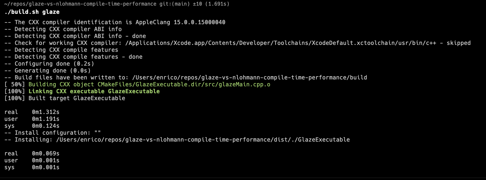
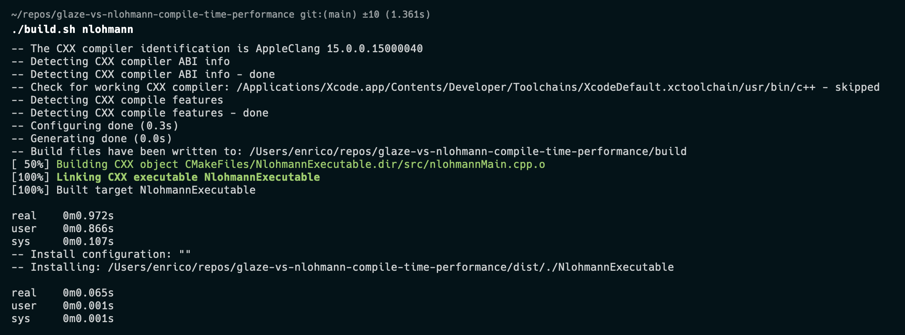

# glaze-vs-nlohmann-compile-time-performance

## Usage 🍕

```sh
./build.sh <glaze|nlohmann>
```

## Performance ⏱️

You can find some insights on compile-time and run-time performances of the Glaze and Nlohmann libraries. The first `time` output refers to compile time, while the second refers to execution time. Keep in mind that the program is too simple to actually get valid insights in execution-time performance, and my main aim was to get to know the compile-time overhead added by each of these libraries.



